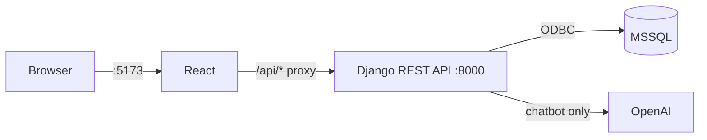

# Notes

## How it works

The app runs as three containers through Docker Compose. React talks to Django through a proxy, so the browser only ever sees one address.

Running docker compose up starts everything, including the database, so there is nothing else to install besides Docker.

## Authentication

The app uses JWT through SimpleJWT over Django sessions, since React is a separate application and needs its own way to confirm who is logged in. Access tokens last an hour, refresh tokens last a week. On the frontend, an axios interceptor attaches the token to every request automatically. If a request comes back with a 401, it requests a new token using the refresh token and retries. The user will not notice this happening unless the refresh token itself has expired, in which case they are sent back to the login page.

## Design decisions
I considered using a queue such as Celery with Redis for this, but decided against it. The whole process finishes in milliseconds and involves no background work, so adding a queue would introduce complexity without solving an actual problem.

Books are soft deleted rather than removed outright. Deleting a book sets is_deleted to True instead of removing the row. If it were a hard delete, past orders referencing that book would break. IDs are also never reused, so gaps after a deletion are expected rather than a bug.

Price is recorded per order. OrderBook.price_at_purchase stores the price at the time the order was placed, separate from the book's current price. This means a later price change does not affect the totals of past orders.

Stock reaching zero automatically marks a book as unavailable. If an admin edits the stock down to zero, availability is set to false without needing a separate manual step.

Indexes are added on the columns that are searched or filtered most often, including isbn, title, availability and status, along with two combined indexes for order history and for browsing the catalogue. This adds a small cost to writes, which is reasonable given the app is read far more often than it is written to.

## Security

Secrets are kept in a .env file and are never committed to the repository. Passwords go through Django's built in validation. CORS is restricted to the frontend's own address. There is also basic rate limiting, thirty requests a minute for users who are not logged in and one hundred and twenty for those who are, mainly to slow down brute force login attempts. Admin only routes are protected using a custom IsAdminUser permission class rather than checking is_admin manually inside each view.

## Order status

Orders move through the stages pending, confirmed, shipped and delivered. An order can be cancelled while it is pending, confirmed or shipped, which covers any point before delivery, and cancelling always restores the stock that was deducted. Once an order is cancelled or delivered, it cannot be changed further. Customers can only cancel an order while it is still pending. After that, only an admin can cancel it.

## API reference

All endpoints are under /api, authentication is done using Authorization: Bearer token.

**Auth**
- POST /register/, anyone, create an account
- POST /token/, anyone, log in and get an access and refresh token
- POST /token/refresh/, anyone, exchange a refresh token for a new access token
- GET/PATCH /profile/, logged in, view or update your own profile

**Books**
- GET /books/, anyone, browse the catalogue, supports ?search=
- GET /books/:id/, anyone, view a single book
- GET/POST /admin/books/, admin only, list all books or add a new one
- PATCH/DELETE /admin/books/:id/, admin only, edit a book or remove it (soft delete)

**Orders**
- GET /orders/, logged in, view your own order history
- POST /orders/create/, logged in, place an order
- POST /orders/:id/cancel/, logged in, cancel an order while it is still pending
- GET /admin/orders/, admin only, view all orders, supports ?status=
- PATCH /admin/orders/:id/, admin only, update an order's status

**Other**
- POST /chat/, logged in, talk to the support chatbot
- GET /admin/stats/, admin only, dashboard figures

## Access by role

Users who are not logged in can browse and search the catalogue, register and log in. They cannot place orders or use the chatbot.

Customers can order books that are in stock, view and cancel their own pending orders, and use the support chatbot. They cannot see other customers' orders, cannot make changes to an order once it has moved past pending, and cannot purchase a book that is out of stock, since the option to buy simply does not appear.

Admins manage the catalogue by adding, editing or removing books, and can move orders through their statuses. They also have access to the stats dashboard. Admins cannot place orders themselves, and there is no option to buy on their view of the catalogue.

A few other rules apply throughout the system. ISBNs must be either 10 or 13 digits, which is checked in both the API and the Django admin form. Price cannot be zero or negative. Quantity must be at least one. Returns and payments are not part of this system, as the scope ends at placing and tracking an order, in line with the assignment.

## Testing

There are 45 tests covering authentication, including registration, login and password rules, books, including CRUD operations, search, soft deletion and validation, orders, including creation, stock locking, cancellation and ensuring customers cannot see each other's orders, and the stats endpoint. These run in CI against a real MSSQL container rather than a mocked database, so the ODBC driver and actual SQL behaviour are also tested.

Formatting and linting are handled by black and flake8, both set to a line length of 88 characters so they remain consistent with each other. Both run automatically in CI on every push.
